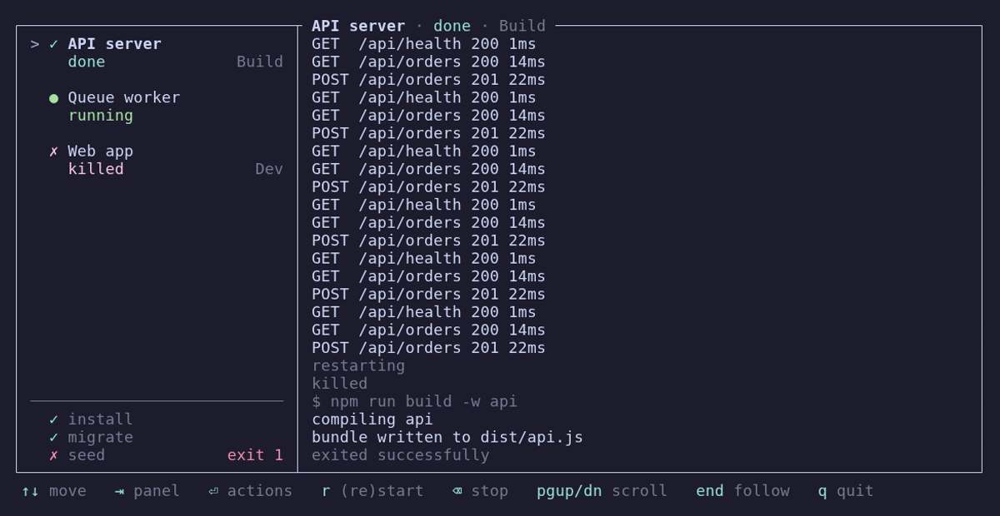

<h1 align="center">tush</h1>

<p align="center">
  One terminal for every process your project needs.<br>
  Dev servers, build watchers, setup scripts — started, supervised and tailed
  in one place.
</p>

---

Write your project's commands down once. `tush` runs them, keeps the tail of
each one's output, and gives you a screen to drive it all from: start, stop,
restart, flip a proc from `build` to `watch`, without leaving the keyboard.

<p align="center">
  
</p>

All of that comes from one file and one command:

```yaml
# tush.yaml
procs:
  install:
    run: [npm, ci]

  api:
    depends: [install]
    run: [npm, start]

  web:
    depends: [install]
    run: [npm, run, dev]
```

```sh
tush run -c tush.yaml
```

## Why tush

- **The screen and the session come apart.** `tush serve` keeps the procs
  running with no screen, and `tush attach` draws one over a Unix socket —
  from inside the container they are running in, if that is where they live.
  Close the screen and nothing dies.
- **One proc, several ways to run it.** `modes` gives a proc a `Build` and a
  `Watch`, and you flip between them from the list without editing anything.
- **Logs are bounded, per proc.** Each one keeps a fixed number of bytes and
  drops the oldest, so the watcher that prints all day costs what you said it
  could.
- **Nothing is left holding a port.** Every proc runs in its own process
  group, restarts never overlap, and shutdown waits for the group to empty —
  `bash -c` wrappers and their children included.
- **Commands are argv, not shell lines.** Nothing gets re-parsed behind your
  back.

Reach for something else when your procs are containers (`docker compose`
already does that), when you just want a Procfile run as-is, or when what you
actually want is a terminal multiplexer. `process-compose` and `mprocs` live
in the same neighbourhood and overlap a lot — if the list above is not what
you are after, one of them probably is.

## Install

Grab the binary from the [latest
release](https://github.com/rhangai/tush/releases/latest):

```sh
tag=v0.1.1
mkdir -p ~/.local/bin
curl -fsSL "https://github.com/rhangai/tush/releases/download/$tag/tush-$tag-x86_64-unknown-linux-gnu.tar.gz" \
  | tar -xz -C ~/.local/bin
```

One tarball, one binary, no runtime to install. It is Linux on x86_64, built
against glibc 2.17, so it runs on distributions a good deal older than the one
that built it. Each release ships a `.sha256` next to the tarball.

Anywhere else, build it — Rust 1.85 or newer (edition 2024), and unix only,
since shutdown leans on signals and process groups:

```sh
cargo install --git https://github.com/rhangai/tush
```

## Getting started

**1. Write a `tush.yaml`.** Each entry under `procs` is one command, written
as its argv — the program, then each argument:

```yaml
procs:
  api:
    name: API server
    run: [cargo, run]

  db-setup:
    panel: minor            # the compact list: setup steps, migrations
    run: [./scripts/db.sh]

  web:
    depends: [db-setup]     # waits for it to finish first
    modes:                  # two ways to run it; pick one on screen
      - name: Build
        run: [npm, run, build]
      - name: Watch
        run: [npm, run, dev]
```

**2. Run it**, naming whatever should come up right away:

```sh
tush run -c tush.yaml web              # start `web` and what it depends on
tush run -c tush.yaml group:backend    # start every proc in a group
tush run -c tush.yaml                  # start nothing; drive it from the screen
```

**3. Drive the rest from the screen.** Anything you did not name is a
keypress away.

Every config key is in [CONFIG.md](CONFIG.md).

## The screen

<p align="center">
  
</p>

Procs on the left, the selected one's output on the right, keys along the
bottom. The list comes in two parts: the procs you sit and watch on top, and
below the rule the ones you only look at when they break (`panel: minor`).

| Mark | Meaning | | Mark | Meaning |
| --- | --- | --- | --- | --- |
| `○` | stopped | | `●` | running |
| `◌` | waiting on a dependency | | `✓` | finished, cleanly |
| `◐` | starting | | `✗` | exited with an error, or was killed |
| `◑` | stopping | | | |

### Keys

| Key | Does |
| --- | --- |
| <kbd>↑</kbd> <kbd>↓</kbd>, <kbd>j</kbd> <kbd>k</kbd> | Move through the list |
| <kbd>Tab</kbd> | Switch lists, each keeping its place |
| <kbd>Enter</kbd> | Open the action menu |
| <kbd>r</kbd> | Start it, or restart it in the mode it is already in |
| <kbd>Backspace</kbd> / <kbd>Delete</kbd> | Stop it |
| <kbd>PgUp</kbd> <kbd>PgDn</kbd>, wheel | Scroll the log |
| <kbd>Shift</kbd> + <kbd>↑</kbd> <kbd>↓</kbd> | Scroll it a line at a time |
| <kbd>End</kbd>, <kbd>G</kbd> | Back to following the tail |
| <kbd>q</kbd>, <kbd>Esc</kbd> | Quit, stopping everything `tush run` started |
| <kbd>Ctrl</kbd>+<kbd>C</kbd> | Quit, from anywhere |

Open the menu on a proc with `modes` to switch between them. Every entry says
what it will do: `Restart` on the mode that is up, `Start` on the others.

## Commands

Four ways to run, differing in where the session lives and where the screen
is:

| | What it does |
| --- | --- |
| `tush run -c tush.yaml [targets]` | Session and screen in one process. Quitting takes the procs with it. |
| `tush serve -c tush.yaml [targets]` | The session with no screen: prints each line as `[proc] line`, listens on a socket. Ends on <kbd>Ctrl</kbd>+<kbd>C</kbd> or `SIGTERM`. |
| `tush attach` | A screen onto a session started by `serve`. Quitting takes nothing down. |
| `tush dispatch start\|stop KEY` | One command to a running session, and out. No screen. |

A *target* is a proc's name, or `group:name` for a whole group. Name none and
nothing starts.

| Flag | On | Means |
| --- | --- | --- |
| `-c`, `--config <PATH>` | `run`, `serve` | The config file. Required, and taken as given — no searching up the tree. |
| `--no-tui` | `run` | Print the output line by line instead of drawing a screen, for a CI log or a pipe. |
| `--socket <PATH>` | `serve`, `attach`, `dispatch` | Which socket to listen on or talk to. Also read from `TUSH_SOCKET`. |
| `--fps <N>` | `run`, `attach` | How often the screen redraws. Default 10. |
| `--refresh-rate <DURATION>` | `run`, `attach` | The same number the other way round: `100ms`, `2s`. |

### `serve` and `attach`

`run` keeps the session and the screen in one process, so closing the screen
closes everything. Split them when the procs should outlive the screen — or
live somewhere you cannot draw one, like a container.

`tush serve` is the session alone. Same procs, same supervision; it prints
every line it captures to stdout tagged with the proc that wrote it (`[api]
listening on :3000`) and listens on a Unix socket. No client can end it: it
runs until <kbd>Ctrl</kbd>+<kbd>C</kbd> or a `SIGTERM`, then stops the procs
in order.

`tush attach` is the screen alone — same panes, same keys, over that socket.
Quitting takes nothing down, so attach and leave as often as you like; the
logs belong to the session, so you get whatever it still holds.

The socket itself:

- Defaults to `$XDG_RUNTIME_DIR/tush.sock`, or `/var/run/tush.sock` where that
  variable is not set: one name both ends can say from memory. `--socket` or
  `TUSH_SOCKET` overrides it.
- A second session on the same machine lands on the same path and is refused,
  with the path in the error. Give it a `--socket` of its own.
- One left behind by a crashed server is taken over automatically. It is
  created `0600`, and its directory has to exist already.

### One command, no screen

`tush dispatch` says one thing to a running session and exits with whether it
worked — for a keybinding, a script, or a shell where a screen is in the way:

```sh
tush dispatch start web            # start it, restarting it if it is up
tush dispatch start web Watch      # start it in its `Watch` mode
tush dispatch stop web
```

The proc is its key — what you wrote it under in the config, not its `name`.
A mode is matched by `name`, then `name_short`, neither minding case, then by
its position in `modes` counting from zero. A proc nothing is declared under
comes back named; a mode that does not exist comes back with the ones that do.
Either way the command exits non-zero.

No `-c`: the session is the one that read the config. `--socket` and
`TUSH_SOCKET` work as they do for `serve` and `attach`.

### In a dev container

The container runs the session; you attach a screen when you want to look.

```dockerfile
FROM node:22
ARG TUSH_VERSION=v0.1.1
RUN apt-get update \
    && apt-get install -y --no-install-recommends curl tini \
    && rm -rf /var/lib/apt/lists/* \
    && curl -fsSL "https://github.com/rhangai/tush/releases/download/$TUSH_VERSION/tush-$TUSH_VERSION-x86_64-unknown-linux-gnu.tar.gz" \
       | tar -xz -C /usr/local/bin
WORKDIR /app
# Both ends agree on this without a flag, and it does not depend on the
# container having an XDG_RUNTIME_DIR.
ENV TUSH_SOCKET=/tmp/tush.sock
# An init as PID 1 — see below.
ENTRYPOINT ["/usr/bin/tini", "--"]
CMD ["tush", "serve", "-c", "tush.yaml"]
```

```sh
docker compose up -d
docker compose logs -f                      # every proc's output, line by line
docker compose exec dev tush attach         # the screen, whenever you want it
```

<kbd>q</kbd> closes that screen and leaves the container running. `docker
stop` sends `SIGTERM` to `tush serve`, which is the orderly path — it gives a
proc ten seconds before `SIGKILL`, and ten is also Docker's own grace period,
so slow procs want a longer `stop_grace_period`.

**Give the container an init.** As PID 1, `tush` inherits every orphan in
there — a `bash -c` wrapper that exits before what it started, anything that
daemonises — and it only reaps what it spawned itself, so the rest pile up as
zombies. That hurts at shutdown more than in memory: a run is not over until
its process group is empty, and a zombie still answers a signal, so a proc
that is really gone can sit there for the full ten seconds. `tini` above does
the reaping; `docker run --init`, or `init: true` in compose, is the same
thing without touching the image.

It works over ssh too, wherever you can get a shell on the session's machine:
`ssh -t host tush attach`.

## Good to know

- **No shell.** A command is an argv, so `|`, `&&`, `>` and `$VAR` are literal
  text. Want a shell, ask for one: `run: [bash, -c, "npm run build | tee out"]`.
- **Logs are a tail, not a transcript.** Each proc keeps a fixed number of
  bytes (1 MiB by default, `log_size` to change it) and drops the oldest to
  make room, so a chatty watcher cannot run away with your memory.
- **Shutdown is orderly.** Each proc gets its own process group, so stopping a
  `bash -c '…'` takes its children too: `SIGTERM`, then `SIGKILL` ten seconds
  later.
- **`depends` means "has finished", not "is up".** It is for the steps that
  end: `npm ci`, a migration, a build. Name a dev server in a `depends` and
  whatever depends on it waits for good.

---

[MIT licensed](LICENSE).
